<p align="center">
  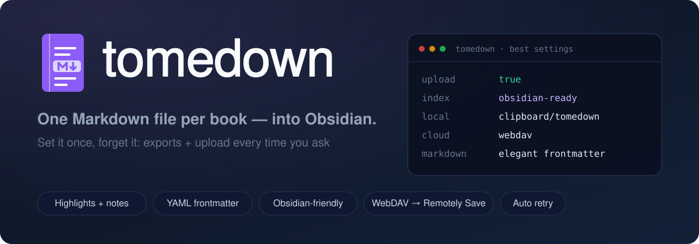
</p>

<p align="center">
  <a href="https://ko-fi.com/imanubdesigner"></a>
  
  
  
  
</p>

<p align="center">
  <a href="https://github.com/imanubdesigner/tomedown.koplugin/releases/latest"></a>
  <a href="https://github.com/imanubdesigner/tomedown.koplugin/actions/workflows/test.yml"></a>
  <a href="LICENSE"></a>
</p>

## Contents

- [Requirements](#requirements)
- [Installation](#installation)
- [Configuration (one-off)](#configuration-one-off)
  - [If you already use AnnotationSync](#if-you-already-use-annotationsync)
  - [Updates](#updates)
- [Usage](#usage)
  - [Special highlights](#special-highlights)
  - [Auto-export and offline reading](#auto-export-and-offline-reading)
  - [Upload retries](#upload-retries)
- [File format](#file-format)
- [Obsidian (optional)](#obsidian-optional)
- [Notes and limitations](#notes-and-limitations)
- [Languages (English / Italian)](#languages-english--italian)
- [Debug](#debug)
- [Tests](#tests)
- [Project structure](#project-structure)
- [Support](#support)
- [License](#license)

A KOReader plugin that exports the highlights of **each book into its own
`.md` file**, with YAML frontmatter and an automatic index. Everything is
written to a folder on the device first (`clipboard/tomedown`, changeable);
uploading to **your cloud** — any WebDAV server, or Dropbox/FTP — is an
option, and so is reading the notes in Obsidian.

The examples in this repo use **Koofr**: its free plan gives you 10 GB,
more than enough for a whole library of `.md` files.

Unlike *Export highlights and notes* (which produces a single combined file),
every volume stays separate:

```
/mnt/us/koreader/clipboard/tomedown/
├── 00 - Index.md
├── Michael McDowell - Blackwater_ The Complete Saga.md
└── ...
```

## Requirements

- KOReader with highlights in the modern format (old `.sdr` files, where
  highlights live in `highlight` + `bookmarks`, are supported too)
- The **Cloud storage** plugin that ships with KOReader, with any server it
  supports (WebDAV, Dropbox, FTP). The examples use Koofr's WebDAV:
  `https://app.koofr.net/dav/Koofr`
  (Koofr's documented WebDAV host — the plain `/dav/` root is not writable).
  **No cloud at all?** The local export works anyway
- Optional, to read the notes in Obsidian: **Remotely Save** with a WebDAV
  server (free) — any other Markdown app works too

## Installation

A full walkthrough — cloud account and app password (Koofr as the example),
first export and optional Remotely Save in Obsidian — is in
[TUTORIAL.md](TUTORIAL.md).

1. Plug the Kindle in via USB mass storage.
2. Get the plugin into `/mnt/us/koreader/plugins/`, either way:

   **a. Release zip (easiest)** — download `tomedown.koplugin-v*.zip` from the
   [Releases](https://github.com/imanubdesigner/tomedown.koplugin/releases)
   page and unzip it *into* that folder: the zip already contains the
   `tomedown.koplugin/` directory.

   **b. From a clone of this repo** — copy the folder, leaving behind what
   KOReader does not need (`tests/`, `assets/`, `README.md`, `TUTORIAL.md`,
   git files):

   ```
   rsync -a --exclude tests --exclude assets --exclude README.md \
         --exclude TUTORIAL.md --exclude .git --exclude .github \
         --exclude .gitignore \
         tomedown.koplugin /mnt/us/koreader/plugins/
   ```

   Either way the result should look like:

   ```
   /mnt/us/koreader/plugins/tomedown.koplugin/main.lua
   /mnt/us/koreader/plugins/tomedown.koplugin/tomedown_i18n.lua
   /mnt/us/koreader/plugins/tomedown.koplugin/tomedown_render.lua
   /mnt/us/koreader/plugins/tomedown.koplugin/_meta.lua
   /mnt/us/koreader/plugins/tomedown.koplugin/languages/it.po
   /mnt/us/koreader/plugins/tomedown.koplugin/LICENSE
   ```

3. Unplug the Kindle and restart KOReader (or: ☰ menu → *Plugin management* →
   enable *Tomedown*).
4. **Tomedown** is the first entry of KOReader's menu: on top of the
   *Navigation* tab (right before *Table of Contents*) while reading, on
   top of the first tab in the file browser (right before *Display mode*):

   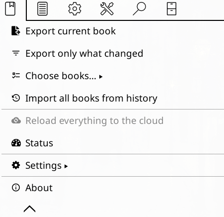

   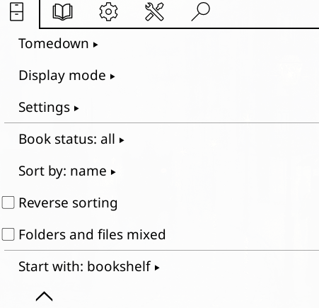

## Configuration (one-off)

☰ menu → **Tomedown** → **Settings**, in three groups:

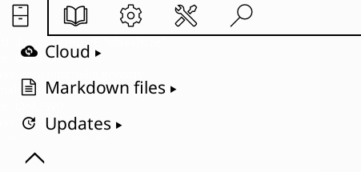

**Cloud**

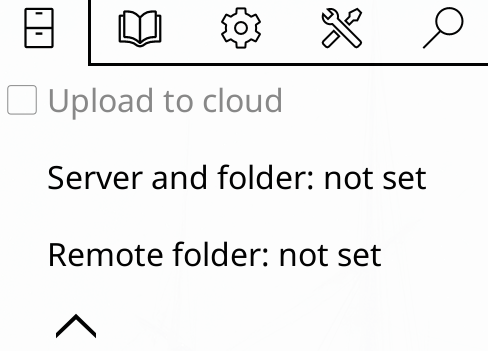

| Entry | What to do |
|---|---|
| *Upload to cloud* | any WebDAV/Dropbox/FTP server works; on by default for installs that have already exported, off on a fresh install |
| *Server and folder…* | opens the Cloud storage browser: pick your server (the examples use Koofr), then navigate to the final folder (e.g. `Bookshelf/Kindle`) and tap **Choose** |
| *Remote folder…* | only if you want to override the folder chosen above (e.g. `/Bookshelf/Kindle`) |

**Markdown files**

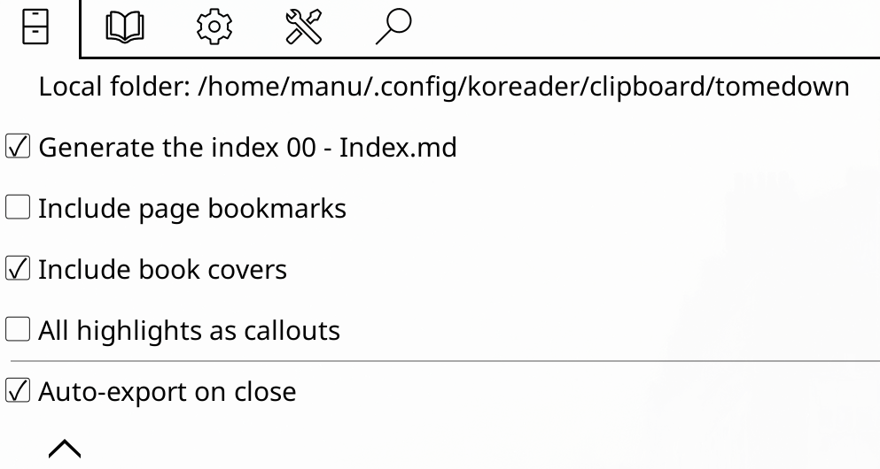

| Entry | What to do |
|---|---|
| *Local folder* | defaults to `clipboard/tomedown` inside KOReader's data folder; tap it to browse with KOReader's folder picker (long-press a folder to choose it) |
| *Generate the index 00 - Index.md* | table with internal links, author, series, reading status, highlight count and last export date |
| *Include page bookmarks* | off by default: adds a `# Page bookmarks` section (bookmarked page + note) after the highlights |
| *Include book covers* | off by default: exports the cover of every book into `covers/` and embeds it in the book file and in the index; the cover is removed from the device once its upload succeeded (the vault copy is the master one). Requires **Obsidian 1.8.1 or newer** to display |
| *All highlights as callouts* | off by default: every highlight becomes an `> [!highlight]` callout instead of a plain quote; when off, only *Special Highlight* marks (see *Usage*) turn into callouts |
| *Auto-export on close* | off by default: exports the book when you close it, and again (silently, no network) before the device suspends |

Ticking or unticking *Include book covers* / *All highlights as callouts*
rewrites every already exported file on the next export (the stored hash is
invalidated, so *Export only what changed* re-sends everything once).

**Updates**

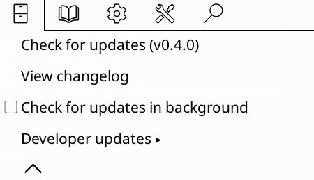

| Entry | What to do |
|---|---|
| *Check for updates (vX)* | the row doubles as the version display: it asks GitHub for newer stable releases, shows their notes and can install the update right away (**Update and restart**) |
| *View changelog* | pages through the notes of every release on GitHub, newest first; the list is cached when a check runs, so the viewer also works offline, and **Refresh** fetches it again |
| *Check for updates in background* | off by default: when enabled, a quiet check runs when KOReader starts and when the menu opens (at most once an hour) and notifies you of a new stable release |
| *Developer updates* | a submenu with everything that is not meant for daily use (below) |

**Developer updates**

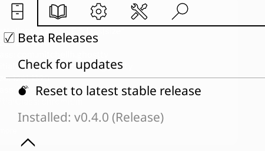

| Entry | What to do |
|---|---|
| *Beta Releases* | off by default: while ticked, the *Check for updates* row below appears and the changelog lists prereleases (tags like `0.4.0-beta.1`) too |
| *Check for updates* | only visible while *Beta Releases* is ticked: checks GitHub for newer prereleases right away and installs them the same way as a stable update |
| *Reset to latest stable release* | installs the newest stable release even when your install is a beta newer than it — the way back from a beta; it also unticks *Beta Releases* so the beta is not offered again |
| *Installed: vX (Release/Beta)* | the installed version as a plain label |

Everything is stored in KOReader's settings, so it applies to all books.

### If you already use AnnotationSync

The cloud server is **inherited automatically** from the one AnnotationSync
already saved in KOReader (`Cloud settings`): *Server and folder…* shows
exactly that. If it is the right folder, you do not have to touch anything.
On a fresh install *Upload to cloud* starts off — tick it once you are
ready to send the `.md` files (installs that have already exported keep
it ticked).

If AnnotationSync uploads its `.json` files somewhere other than where you
want the `.md` files (say `/Bookshelf/Kindle`), set **Remote folder…** and
type the correct path: it applies to this plugin only.

Tip: keep the `.md` files in a folder where AnnotationSync's JSONs do not
land, or add `*.json` to Remotely Save's *Ignore list* so only the notes
reach Obsidian.

### Updates

*Check for updates (vX)* compares the installed version with the releases
on GitHub and shows the notes of **every** release newer than yours, so
someone updating from 0.2.0 to 1.0 reads the fixes of 0.3.0, 0.3.1 and
1.0 in one window. When your KOReader renders Markdown, the notes keep
their formatting (bold, headings, lists); older versions get them as
plain text. Tap **Update and restart** and the new version is
installed for you: the release zip is downloaded from the release page,
unpacked over the plugin folder and KOReader asks to restart. If the
download or the unpacking fails, the releases page opens instead so the
zip can be taken by hand (see *Installation*) — that works from any
older version.

Tick **Beta Releases** (*Settings → Developer updates*) to get the
beta channel: a second **Check for updates** appears right below the
box and offers prereleases (tags like `0.4.0-beta.1`) — the way to try
a new feature before its final release. The check in *Settings →
Updates* stays on stable releases whatever the toggle says, and
unticking *Beta Releases* hides the beta check again. A beta install
always sees the final release of the
same version even with the box unticked: checking for updates from
`0.4.0-beta.1` offers `0.4.0`.

**View changelog** pages through the notes of every release GitHub
knows (newest first, up to 25 of them). The list is saved whenever a
check runs, so the viewer also works without a connection, and
**Refresh** fetches it again. With *Beta Releases* ticked the
prereleases are listed too.

**Reset to latest stable release** (*Settings → Developer updates*) is
the way back from a beta: it installs the newest stable release even
when your beta install is newer than it (the check only ever offers
*newer* versions). Confirm, and it also unticks *Beta Releases* so the
same beta is not offered again on the next check.

When you publish a release, bump `version` in `_meta.lua` to the tag
without the `v`.

The updater is built to keep working from old installs: repository and
API URL never change, tags stay `vX.Y.Z` (prereleases `vX.Y.Z-beta.N`),
release zips keep the `tomedown.koplugin/` top-level folder, and
settings keys are never renamed.

## Usage

☰ menu → **Tomedown**:

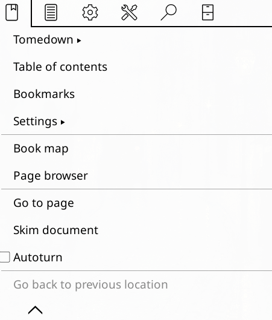

- **Export current book** — only the open book.
- **Export only what changed** — exports only the books whose highlights changed since
  the last export (per-book hash).
- **Choose books…** — a list with checkboxes: tick the volumes and export
  just those.
- **Import all books from history** — exports everything found in KOReader's
  reading history.
- **Reload everything to the cloud** — re-uploads every file already in the
  local folder (use it after a failed upload).
- **Status** — a wide popup (90% of the screen) in a small font: one line
  per entry, labels in bold, with network, server, pending uploads and
  the last export/upload with their timestamp and outcome.

  
- **Settings** — see above.
- **About** — a popup with the logo, the installed version, the description
  and the GitHub link (tap the link to open it or copy it).

On a fresh install, the first time you open the menu, Tomedown offers to
import your whole KOReader reading history in one tap (*Export* / *Not now* — the
offer is made only once; the menu entry stays available anyway).

### Special highlights

Every book has a handful of highlights that really matter: the quote you
want to open first, the line you will come back to. **Special Highlight**
is the flag for those and only those. The mark lives inside the book's
own settings and is part of the book's hash, so the next export rewrites
that file; the flagged highlight is always exported as an `> [!highlight]`
callout — even when *All highlights as callouts* is off — so it stays
visually apart in Obsidian. A notification confirms every change.

Marking it costs a single tap wherever you already are. **Selecting
text** puts the row right under *Highlight*: one tap creates the
highlight and flags it.

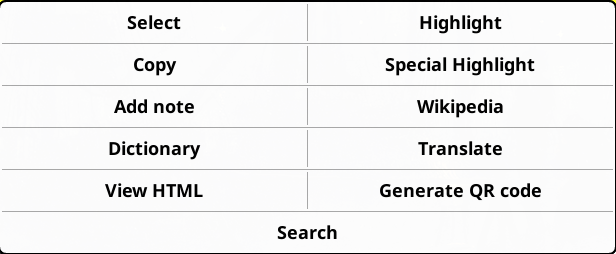

**Tapping an existing highlight** opens the compact edit menu (trash,
Style, Color, …): the same row sits at the bottom, after the arrows. The
label tells what the tap will do — *Special Highlight* flags it,
*Remove Special Highlight* takes the flag off, and the menu closes with
a notification either way.

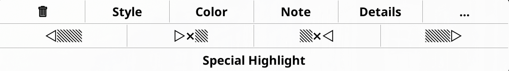
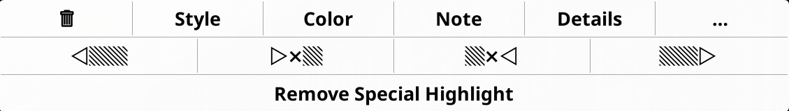

The full menu behind the "…" button carries the same dynamic row, so a
flagged highlight always offers its own undo — and lets you flag one
you had missed.

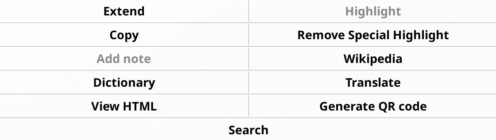

After every export, if *Upload to cloud* is on, the `.md` files and the index
are uploaded to the chosen server automatically. With *Include book covers*
ticked the `covers/` folder travels with them; every cover is deleted from
the device right after its upload succeeded (offline, it waits in the
pending list and goes up with the next connection; with the option off, no
image folder is created at all).

### Auto-export and offline reading

With *Auto-export on close* enabled, closing a book exports it on the spot;
suspending the device does the same right before sleep — silently, without
any widget and without touching the network.

No connection? The export still happens locally and the files wait in a
pending list. As soon as KOReader comes back online (the connection event
is enough — no prompt, no dialog), **only those pending files** are
uploaded: books already in the cloud and unchanged are never re-sent, and
a book whose highlights changed since its last upload is uploaded again,
overwriting the old copy. Failed uploads stay pending and are retried on
the next connection.

### Upload retries

While uploading, an *Uploading N files to the cloud…* message stays on screen
(including the wait times), and each file is tried **up to 3 times** with
exponential backoff:

| attempt | wait before the next one |
|:--:|:--:|
| 1 | 2 seconds |
| 2 | 4 seconds |
| 3 | done: the file is marked as failed |

Only **transient** failures are retried:

- network errors (no HTTP code, e.g. `connection reset`, timeout);
- `5xx` (server temporarily unavailable);
- `408` (request timeout) and `429` (too many requests).

`4xx` errors (missing remote folder, wrong credentials…) are **not** retried:
the file fails immediately, because retrying would only cost waiting.

If a file still fails after the 3 attempts, a window shows
`Cloud: X uploaded, Y errors` and everything else continues: the files stay in
the local folder, so you can fix the problem and use **Reload everything to
the cloud**. The attempts are also logged:

```
tomedown: upload failed (attempt 1 of 3), retrying in 2 s: <path> 500
```

## File format

```markdown
---
title: "Blackwater"
author: "Michael McDowell"
series: "Blackwater"
series_index: 1
language: "it"
pages: 1140
exported: 2026-09-26
highlights: 150
status: "complete"
progress: "96%"
tags:
  - ebook
  - highlights
  - horror
  - gothic-fiction
---

# **HIGHLIGHTS: 150**

---

# Chapter I

> First highlighted sentence.
> Second line of the same highlight.

- **p. 10** · 02/09/2026 10:00 · note: to reread

> Another highlight.

- **p. 12** · 03/09/2026 11:30

---

# Page bookmarks

> Check the epilogue again

- **p. 120** · 04/09/2026 08:15
```

- the frontmatter keeps what KOReader knows about the book: `series` and
  `series_index` (only when the book belongs to a series), `language`,
  `pages`, the reading `status`
  (`reading` / `abandoned` / `complete`), `progress` and the book's
  keywords appended to `tags`; a field KOReader does not know (ISBN, for
  instance) is simply not there, and unknown fields are omitted
- **only highlights** are exported by default: page bookmarks and deleted
  annotations are left out — tick *Include page bookmarks* in Settings to
  get the `# Page bookmarks` section shown above
- with *Include book covers* ticked the file also carries `cover:
  "covers/Author - Title.jpg"` in the frontmatter and an `` right
  after it (before the `# **HIGHLIGHTS**` heading). The cover is the
  embedded one (or the custom cover KOReader knows), resized into a
  800×1200 JPEG and dropped from the device after a successful upload —
  the copy in the vault is the master one. Obsidian renders such images
  starting with **version 1.8.1**
- highlights marked **Special Highlight** (see *Usage*) are rendered as
  `> [!highlight]` callouts; with *All highlights as callouts* ticked
  every highlight gets the marker, otherwise only the special ones:

  ```markdown
  > [!highlight]
  > First highlighted sentence.
  > Second line of the same highlight.

  - **p. 10** · 02/09/2026 10:00 · note: to reread
  ```
- the file name matches KOReader's standard exporter (`Author - Title`), so
  it does not clash with exports you already made
- the page is the stable page number (`pageref`) when available, otherwise
  the running page number; the date under each highlight includes the
  time (`HH:MM`)
- files exported by an older version of tomedown keep their old look
  until they are rebuilt: run *Import all books from history* once and
  every file is rewritten in the current format
- the index uses wiki links (`[[…]]`), opened natively by Obsidian and by
  most Markdown apps; with covers enabled the first column shows the
  cover image (90×120 box):

  ```markdown
  |  | [[Michael McDowell - Blackwater\|Blackwater]] | Michael McDowell | Blackwater #1 | complete | 150 | 26/09/2026 |
  ```

  Without the option the cover column disappears; books without a series
  or a reading status show a dash in those cells.

The sample above is what an English KOReader produces; with an Italian
interface the same text comes out translated (see *Languages*).

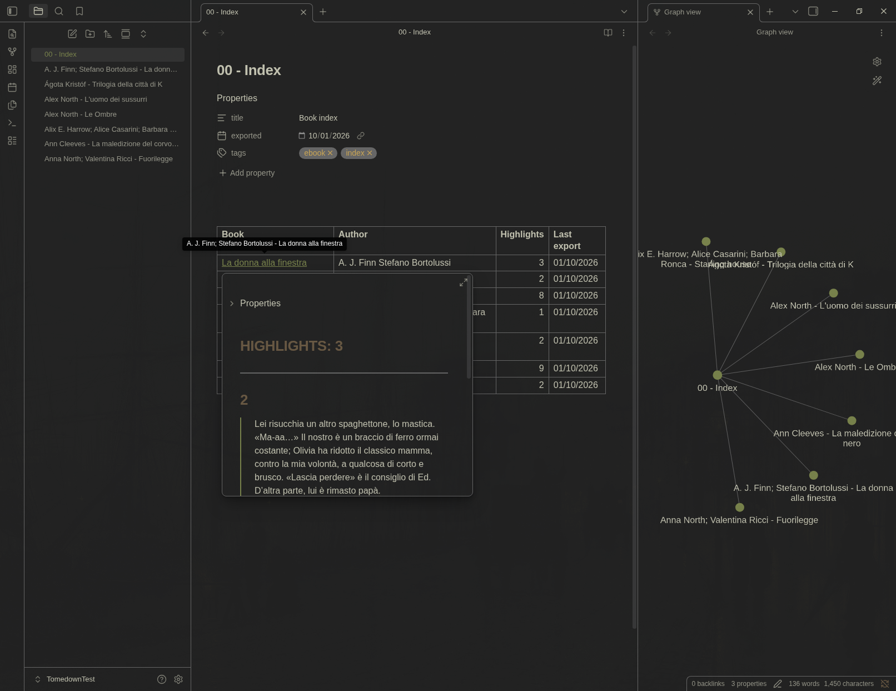

## Obsidian (optional)

Obsidian is just one way to read the notes: the files are plain Markdown,
so any editor, reader or wiki works. If you do use Obsidian, only
**Remotely Save** needs configuring here: the Tomedown plugin lives on
KOReader, nothing special has to be installed in Obsidian. **Book covers
(*Include book covers*) require Obsidian 1.8.1 or newer** — that is the
version that started rendering `` tags whose `src` points at a file
inside the vault; older versions show a broken image. The steps below
use Koofr (this README's example cloud); with any other WebDAV server —
Nextcloud, ownCloud, a NAS… — substitute its address and credentials.

1. On Koofr create an app (Security → Applications) and copy the **app
   password**, not the account one.
2. In Obsidian install **Remotely Save** and configure:
   - type: **WebDAV**
   - server: `https://app.koofr.net/dav/Koofr`
   - user: your Koofr account e-mail
   - password: the app password
   - **remote folder / base dir: `/Bookshelf`**
3. In Remotely Save's local data, point to the folder that holds your books
   vault (in this example `Bookshelf/`).
4. Sync.

Result: `Bookshelf/Kindle/*.md` arrive in Obsidian, `00 - Index.md` opens as
a clickable table and every title opens that book's file.

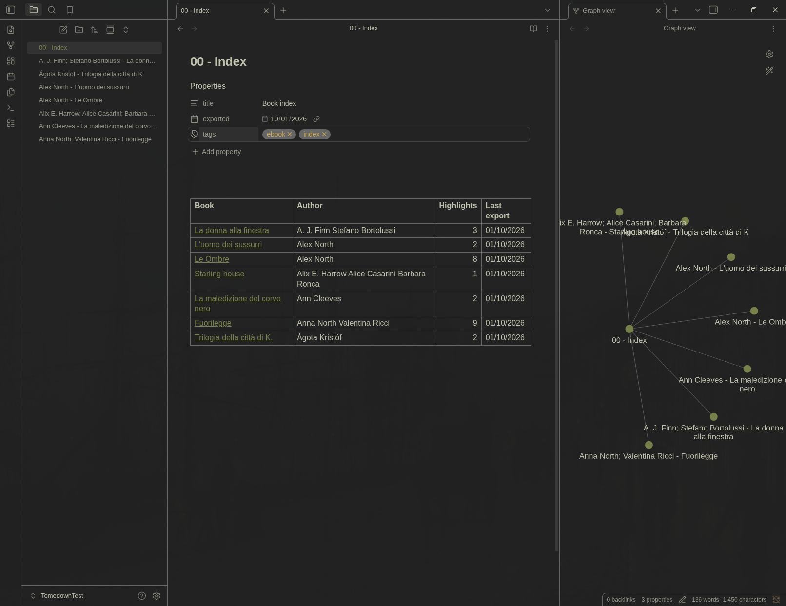


https://github.com/user-attachments/assets/a345caf7-bf6d-42c7-87fa-177d601790fa


## Notes and limitations

- The `.md` files are **rewritten on every export**: treat them as read-only
  in your editor, otherwise your edits disappear next time.
- The plugin **never touches** AnnotationSync's files (`<md5>.json`,
  `settings_sync.json`): it only reads the `.sdr` folders.
- Uploads go through KOReader's *Cloud storage* plugin: if it is not active,
  the local export still works, only the upload is skipped.
- If an upload fails (missing remote folder, no connection), the files stay
  in the local folder: fix it and use **Reload everything to the cloud**.

## Languages (English / Italian)

Plugin strings are **English** in the code (`_("…")`), as KOReader
conventions require, and are shown **in Italian** when KOReader's interface
is Italian: no setting to change, only KOReader's language matters.

How it works: KOReader only translates its core (`l10n/<lang>/koreader.mo`)
and does **not** load plugin `.po` files automatically, so
`tomedown_i18n.lua` reads `languages/it.po` based on the current language
(`GetText.current_lang`, falling back to *Settings → Language*) and swaps the
texts. On English (or when no translation exists) the original msgid is
used.

The text inside the `.md` files is translated too (titles,
`No chapter`, `N highlights`, `note:`, `Page bookmarks`, `Book index`, table
headers), so your exported notes follow KOReader's language.

To fix or add a translation: edit `languages/it.po` (msgid = English source,
msgstr = Italian) and restart KOReader. It is standard gettext: for another
language just copy it to `languages/<code>.po`.

## Debug

In case of trouble:

```
/mnt/us/koreader/crash.log
```

Plugin messages are prefixed with `tomedown:`.

## Tests

The suite lives in `tests/` and needs Lua 5.3 or newer (the test md5 uses
bitwise operators):

```
cd tests && ./run.sh
```

It covers Markdown rendering, `languages/it.po` sync, runtime translations
and the behaviour of `main.lua` (export, menu, dialogs, fallback servers,
uploads and retries) against a fake KOReader environment (`kostubs/`). It
finishes with `luac5.1 -p` on the sources — the same Lua version that runs
on the Kindle. The same suite runs on every push through GitHub Actions.

## Project structure

```
tomedown.koplugin/
├── _meta.lua              plugin name and description
├── main.lua               menu, .sdr reading, export, upload (with retries)
├── tomedown_render.lua    Markdown builder (pure, testable)
├── tomedown_i18n.lua      reads languages/<lang>.po (English/Italian)
├── languages/
│   └── it.po              Italian translation (read by tomedown_i18n)
├── tests/                 test suite + fake KOReader environment
│   ├── run.sh             runs everything, ends with luac5.1 -p
│   ├── kostubs/           stubs for KOReader's Lua modules
│   └── test_*.lua
└── README.md
```

## Support

If Tomedown saves your reading, buy it a coffee — the next features are
brewed with it.

<p align="center">
  <a href="https://ko-fi.com/imanubdesigner">
    
  </a>
</p>

## License

GNU Affero General Public License v3.0 — see [LICENSE](LICENSE).
